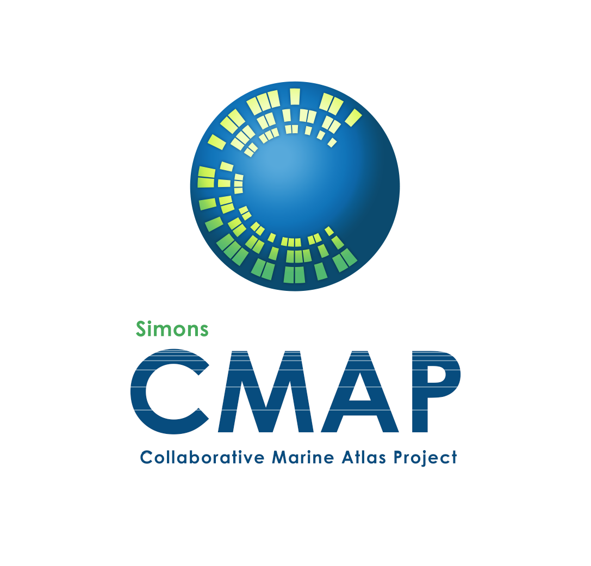

*Mohammad Dehghani Ashkezari <mdehghan@uw.edu>*, 

*Raphael Hagen*,

*Mike Denholtz, and*

*Ginger Armbrust*

# Pycmap
Simons CMAP is an open-source data service to retrieve, visualize, and analyze oceanic datasets such as in-situ observations, multi-decade global satellite remote sensing, and model outputs. Pycmap is the python package of Simons CMAP project providing a simple and unified interface to the hosted datasets at Simons CMAP database. It enables the scientists and general public to dive into the vast, and often underutilized, ocean datasets and retrieve customized subsets of these massive datasets without going through the time-consuming process of data collection and preparation.

## Documentation
See the *table of contents* below for pycmap documentations. 
 The docs are written in jupyter notebook format and each notebook contains one or more example codes. Please download the `/docs` directory and run the example codes locally. Alternatively, you may run the examples on google cloud using the *Colab badge* which appears at the top of each page: 
 

  More detailed system documentations can be found at [https://cmap.readthedocs.io/en/latest/](https://cmap.readthedocs.io/en/latest/).

## Website
Simons CMAP website is under active development at the moment: [https://simonscmap.com](https://simonscmap.com)

** This project is supported by [Simons Foundation](https://www.simonsfoundation.org/).**

## Table of Contents

### [Installation](docs/Installation.ipynb)

### [1. Data Retrieval (API)](docs/API.ipynb)
- [Query](docs/Query.ipynb)
- [Catalog](docs/Catalog.ipynb)
- [Search Catalog](docs/SearchCatalog.ipynb)
- [Datasets](docs/Datasets.ipynb)
- [Dataset MetaData](docs/DatasetMetaData.ipynb)
- [Variable MetaData](docs/MetaData.ipynb)
- [Dataset Columns](docs/Columns.ipynb)
- [Dataset Head](docs/Head.ipynb)
- [Variable Long Name](docs/LongName.ipynb)
- [Variable Unit](docs/Unit.ipynb)
- [Variable Resolution](docs/Resolution.ipynb)
- [Variable Coverage](docs/Coverage.ipynb)
- [Variable Stat](docs/Stat.ipynb)
- [If Column Exists](docs/HasField.ipynb)
- [Is Gridded Product](docs/Grid.ipynb)
- [Is Climatology Product](docs/Climatology.ipynb)
- [List of Cruises](docs/Cruises.ipynb)
- [Cruise Details by Name](docs/CruiseByName.ipynb)
- [Cruise Spatio-Temporal Bounds](docs/CruiseBounds.ipynb)
- [Cruise Trajectory](docs/CruiseTrajectory.ipynb)
- [Cruise Variables](docs/CruiseVariables.ipynb)
- [Retrieve Dataset](docs/RetrieveDataset.ipynb)
- [Data Subset: Generic Space-Time Cut](docs/SpaceTime.ipynb)
- [Data Subset: TimeSeries](docs/TimeSeries.ipynb)
- [Data Subset: Depth Profile](docs/DepthProfile.ipynb)
- [Match (colocalize) Datasets](docs/Match.ipynb)
- [Match (colocalize) Cruise Track with Datasets](docs/MatchCruise.ipynb)

### [2. Data Visualization](docs/Viz.ipynb)
- [Histogram Plot](docs/Viz_Histogram.ipynb)
- [TimeSeries Plot](docs/Viz_TimeSeries.ipynb)
- [Regional Map, Contour Plot, 3D Surface Plot](docs/Viz_RegionalMap.ipynb)
- [Section Map, Section Contour](docs/Viz_Section.ipynb)
- [Depth Profile](docs/Viz_DepthProfile.ipynb)
- [Cruise Track Plot](docs/Viz_CruiseTrack.ipynb)
- [Correlation Matrix](docs/Viz_CorrelationMatrix.ipynb)
- [Correlation Matrix Along Cruise Track](docs/Viz_CruiseCorrelationMatrix.ipynb)

